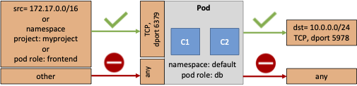

# Network Policy Lab

- [Network Policy Lab](#network-policy-lab)
  - [Objectives](#objectives)
  - [Network Policy overview](#network-policy-overview)
  - [Inter POD communication](#inter-pod-communication)
  - [Deploy three-tier application](#deploy-three-tier-application)
  - [Apply Network Policy](#apply-network-policy)
  - [Egress Communications](#egress-communications)

---

## Objectives

- Learn about Kubernetes Network Policy.
- Define and apply Network Policy.
- Check Network Policy behaviour.

---

## Network Policy overview

NetworkPolicies are an application-centric construct which allow you to specify how a pod is allowed to communicate with various network "entities" (we use the word "entity" here to avoid overloading the more common terms such as "endpoints" and "services", which have specific Kubernetes connotations) over the network.  

The entities that a Pod can communicate with are identified through a combination of the following 3 identifiers:

1. Other pods that are allowed (exception: a pod cannot block access to itself)
2. Namespaces that are allowed
3. IP blocks (exception: traffic to and from the node where a Pod is running is always allowed, regardless of the IP address of the Pod or the node)

When defining a pod- or namespace- based NetworkPolicy, you use a selector to specify what traffic is allowed to and from the Pod(s) that match the selector.  

Meanwhile, when IP based NetworkPolicies are created, we define policies based on IP blocks (CIDR ranges).  

The figure below highlights the Kubernetes Network Policy concept:  



For more information about Network Policy please refer to [Kubernetes Documentation - Network Policies](https://kubernetes.io/docs/concepts/services-networking/network-policies/)

---

## Inter POD communication

In the following we will use Netcat tool to check network connectivity when NetworkPolicy is applied. Netcat is a utility that reads and writes data across network connections, using the TCP or UDP protocol. It is a feature-rich network debugging and exploration tool since it can create almost any kind of connection you would need. We will execute several tests to understand inter Pod communication without Network Policy applied.

1. Launch Netcat to listen on port 8888 on bb1:

    ```bash
    kubectl -i -t exec bb1 -- nc -vlkp 8888 -e /bin/sh
    ```

    Output is similar to:

    ```bash
    listening on [::]:8888 ...
    ```

2. Export the IP address of Pod bb1:

    ```bash
    export bb1_ip=$(kubectl get pod bb1 -o go-template --template '{{.status.podIP}}')
    ```

3. Try to connect from bb2 to bb1 IP address on port 8888:
  
    You need to open a new terminal to execute the command line

    ```bash
    kubectl -i -t exec bb2 -- nc -znv -w 2 $bb1_ip 8888
    ```

    Output is similar to:

    ```bash
    100.115.37.81 (100.115.37.81:8888) open
    ```

4. Execute nc on bb2 to connect bb1 using DNS resolution

    ```bash
    kubectl -i -t exec bb2 -- nc -znv -w 2 bb1:8888
    ```

    Output is similar to:

    ```bash
    nc: bad address 'bb1'
    command terminated with exit code 1
    ```

    It means that bb2 doesn't resolve the bb1 name. For resolution to happen, we need to add Kubernetes Services resource for the busybox pods.

5. Apply services for bb1 and bb2 DNS resolution:

    ```bash
    kubectl apply -f 01-bb-services-none-ClusterIP.yaml
    ```

    Output is similar to:

    ```bash
    service/bb1 created
    service/bb2 created
    ```

6. Execute nc on bb2 to connect bb1 using DNS resolution

    ```bash
    kubectl -i -t exec bb2 -- nc -znv -w 2 bb1 8888
    ```

    Output is similar to:

    ```bash
    bb1 (100.115.37.81:8888) open
    ```

7. Check IP addresses used for bb1 - bb2 communications

    From the terminal used to execute nc to listen on port 8888, output is similar to:

    ```bash
    listening on [::]:8888 ...
    connect to [::ffff:100.115.37.81]:8888 from [::ffff:100.106.133.221]:40439 ([::ffff:100.106.133.221]:40439)
    ```

    We notice the Pod can communicate with each other directly without using NAT even if a service configured is used for DNS resolution, but still with clusterIP: None option.

---

## Deploy three-tier application

  By default the Pods can communicate with each others and Kubernetes Network Policy provides a mechanism to enforce rules between Pods or type of Pods. In the following we will consider the example of a three tier application including front-end, backend and database resources and we will apply network policy to enforce network security between the tiers.

1. Deploy permanent volume and volume claim

    As we need to run a database application, we first deploy permanent storage resource in order to keep information permanent even if the Pods are destroyed.

    We will apply the following configuration to create a permanent volume named mysqldb-pv and volume claimed mysqldb-pvc:

    ```yaml
    apiVersion: v1
    kind: PersistentVolume
    metadata:
      name: mysqldb-pv
      labels:
        type: local
    spec:
      storageClassName: manual
      capacity:
        storage: 10Gi
      accessModes:
        - ReadWriteOnce
      hostPath:
        path: "/mnt/pv"
    ---
    apiVersion: v1
    kind: PersistentVolumeClaim
    metadata:
      name: mysqldb-pvc
    spec:
      storageClassName: manual
      accessModes:
        - ReadWriteOnce
      resources:
        requests:
          storage: 10Gi
    ```

    ```bash
    kubectl apply -f 02-mysqldb-pv.yaml
    ```

    Output is similar to:

    ```bash
    persistentvolume/mysqldb-pv created
    persistentvolumeclaim/mysqldb-pvc created
    ```

2. Deploy mysql database application and service

    We will apply the following Deployment configuration to manage the mysql database application:

    ```yaml
    apiVersion: v1
    kind: Service
    metadata:
      name: mysqldb
    spec:
      ports:
      - port: 3306
      selector:
        app: mysqldb
      clusterIP: None
    ---
    apiVersion: apps/v1
    kind: Deployment
    metadata:
      name: mysqldb
    spec:
      selector:
        matchLabels:
          app: mysqldb
      strategy:
        type: Recreate
      template:
        metadata:
          labels:
            app: mysqldb
            tier: database
        spec:
          containers:
          - image: mysql:latest
            name: mysqldb
            env:
              # Use secret in real usage
            - name: MYSQL_ROOT_PASSWORD
              value: password
            ports:
            - containerPort: 3306
            volumeMounts:
            - name: mysqldb-persistent-storage
              mountPath: /var/lib/mysql
          volumes:
          - name: mysqldb-persistent-storage
            persistentVolumeClaim:
              claimName: mysqldb-pvc
    ```

    ```bash
    kubectl apply -f 03-mysqldb-deployment.yaml
    ```

    Please note the mysql database application deployment:

    - is referencing the ```mysqldb-pvc``` persistent volume claim configured before
    - is labeled with ```tier: database```, it will be used later on in the network policy resource

    Together with the deployment a service ```name: mysqldb``` is also configured:

    - with a selector to target labeled Pods with ```app: mysqldb```
    - with ```port: 3306``` exposed

    Output is similar to:

    ```bash
    service/mysqldb created
    deployment.apps/mysqldb created
    ```

3. Deploy Backend tier

    We will apply the following Deployment and Service configuration to manage the mysql database application:

    ```yaml
    apiVersion: apps/v1
    kind: Deployment
    metadata:
      name: flaskback
      labels:
        app: flaskback
    spec:
      replicas: 1
      selector:
        matchLabels:
          app: flaskback
      template:
        metadata:
          labels:
            app: flaskback
            tier: backend
        spec:
          containers:
            - name: flaskback
              image: pnivaggi/flaskback
              ports:
                - containerPort: 5000
              env:
                - name: MYSQL_SERVICE_PORT
                  value: "3306"
                - name: MYSQL_SERVICE_HOST
                  value: "mysqldb"
                - name: MYSQL_DEFAULT_DB
                  value: mydb
                # Use secret in real usage
                - name: MYSQL_ROOT_PWD
                  value: "password"

    ---
    apiVersion: v1
    kind: Service
    metadata:
      name: flaskback
    spec:
      ports:
      - port: 5000
        protocol: TCP
        targetPort: 5000
      selector:
        app: flaskback
      clusterIP: None
    ```

    Please note the flaskback backend application deployment:

    - is selecting the ```app: flaskback``` labeled Pods
    - is labeled with ```tier: backend```, it will be used later on in the network policy resource

    Together with the deployment a service ```name: flaskback``` is also configured:

    - with a selector to target labeled Pods with ```app: flaskback```
    - with ```port: 5000``` and  ```protocol: TCP``` exposed

    ```bash
    kubectl apply -f 05-flaskback-deployment.yaml 
    ```

    Output is similar to:

    ```bash
    deployment.apps/flaskback created
    service/flaskback created
    ```

---

## Apply Network Policy

1. Check bb2 can get access to mysql database

   ```bash
   kubectl -i -t exec bb2 -- nc -znv -w 2 mysqldb 3306
   ```

   Output is similar to:

   ```bash
   mysqldb (100.106.133.234:3306) open
   ```
  
   It means that any Pod can get access to the database application which is something we want to prevent with the help of Network Polciy.

2. Apply Network Policy configuration

   We apply the network policy configuration below:

   ```yaml
    kind: NetworkPolicy
    apiVersion: networking.k8s.io/v1
    metadata:
      name: mysqldb
      namespace: default
    spec:
      podSelector:
        matchLabels:
          app: mysqldb
      ingress:
      - from:
        - podSelector:
            matchLabels:
              tier: backend
        ports:
          - protocol: TCP
            port: 3306
      egress:
        - to: []
    ```

   Please note the NetworkPolicy configuration:

   - is applied to Pods with label ```app: mysqldb```
   - includes an ingress policy which allow ```port: 3306```, ```protocol: TCP``` from Pod labeled with ```tier: backend```
   - includes an egress policy which allow all traffic

    ```bash
    kubectl apply -f 06-mysqldb-network-policy.yaml
    ```

   Output is similar to:

   ```bash
   networkpolicy.networking.k8s.io/mysqldb created
   ```

3. Check if bb2 can get access to mysql database

   ```bash
   kubectl -i -t exec bb2 -- nc -znv -w 2 mysqldb 3306
   ```

   ```bash
   nc: mysqldb (100.106.133.234:3306): Connection timed out
   command terminated with exit code 1
   ```

   Note the communication is prevented as bb2 is not labeled with ```tier:backend```
  
4. Check if flaskback backend can get access to mysql database

   The flaskback application exposes a route /blogs which queries the mysql application to retrieve blogs stored in the database.

   ```bash
   kubectl run -it --rm --image=busybox --restart=Never bb-client -- wget -qO- -T 5 flaskback:5000/blogs
   ```

   ```bash
   [["K8s is fun","K8s allows to orchestrate application"],["Network Policy","it provides network security using selector/label"]]
   pod "bb-client" deleted
   ```

   Note the communication is allowed as flaskback application has been deployed with the label ```tier:backend```

---

## Egress Communications

1. Check bb2 Pod can get access to the internet

    ```bash
    kubectl -i -t exec bb2 -- nc -znv -w 2 www.google.com 80
    www.google.com (142.250.65.68:80) open
    ```

    Output is similar to:

    ```bash
    www.google.com (142.250.65.68:80) open
    ```

2. Apply a default deny egress network policy

    To prevent access to the internet from Pods which doesn't need it we apply the following policy:

    ```yaml
    apiVersion: networking.k8s.io/v1
    kind: NetworkPolicy
    metadata:
      name: default-deny-egress
    spec:
      podSelector: {}
      policyTypes:
      - Egress
      egress: []
    ```

    Please not the policy:

     - applies to all the pod as podSelector is {}
     - block egress traffic as egress allowed destination is empty []

    ```bash
    kubectl apply -f 07-default-deny-egress-network-policy.yaml 
    ```

    Output is similar to:

    ```bash
    networkpolicy.networking.k8s.io/default-deny-egress created
    ```

3. Check the bb2 Pod is not able to join the Internet

    ```bash
    kubectl -i -t exec bb2 -- nc -znv -w 2 www.google.com 80
    ```

    Output is similar to:

    ```bash
    nc: bad address 'www.google.com'
    command terminated with exit code 1
    ```

    Note the Pod can't access the internet, but it seems to be due to a DNS resolution issue as we have ```nc: bad address``` error message. Let's apply a more specific egress policy which block access to the internet but allow DNS resolution.
  
4. Apply a default deny egress network policy except DNS

    ```bash
    kubectl apply -f 08-default-deny-egress-except-dns-network-policy.yaml
    ```

    Output is similar to:

    ```bash
    networkpolicy.networking.k8s.io/default-deny-except-dns-egress created
    ```

5. Check the bb2 Pod is not able to join the Internet

    ```bash
    kubectl -i -t exec bb2 -- nc -znv -w 2 www.google.com 80
    ```

    Output is similar to:

    ```bash
    nc: www.google.com (172.217.12.228:80): Connection timed out
    command terminated with exit code 1
    ```

    Note the Pod can't access the internet, but this time the DNS resolution is allowed.
